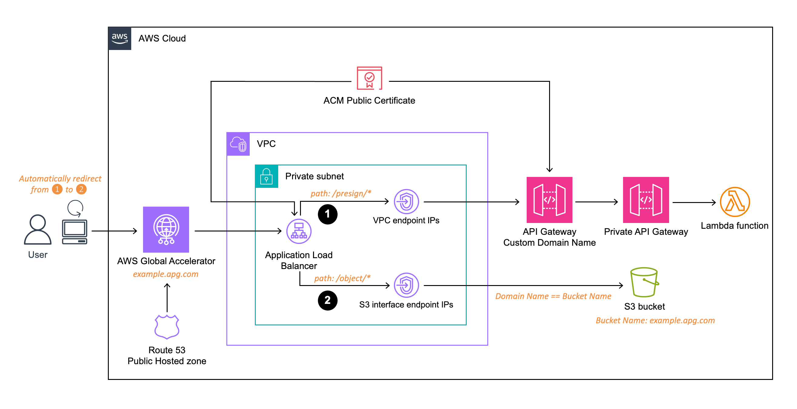

# Consolidate S3 Presigned URL Generation and Object Downloads via an Endpoint Associated with Static IPs

# Summary
This solution simplifies access to Amazon S3 by creating secure, custom presigned URLs for object downloads through a single endpoint with a unique domain and static IPs. It's tailored for clients who require consolidation of both API and S3 endpoints under a unified domain with static IPs. The use case involves users following an IP and domain Allowlist firewall policy, limiting API access to specific domains and IPs.

The architecture employs key AWS services, including AWS Global Accelerator, Amazon API Gateway, AWS Lambda, Application Load Balancer(ALB), VPC Endpoint, and Amazon S3. This design centralizes the API for generating presigned URLs and the S3 endpoint under a single domain, linked to an AWS Global Accelerator with two static IPs. Consequently, users can effortlessly request presigned URLs and download S3 objects through a unified domain endpoint with static IPs.

This architecture is especially beneficial for customers with strict policies or compliance requirements, such as those in the public, medical, and finance sectors.

# Architecture

## Target technology stack

- Amazon Global Accelerator

- Application Load Balancer

- Amazon API Gateway

- AWS Lambda (Python3 or Node.js)

- Amazon S3

## Target architecture


### The diagram illustrates the following concept and flow:

1. A user initiates a request to generate a presigned URL via the custom endpoint served through AWS Global Accelerator, using the custom domain name and associated IP addresses.

2. An AWS Lambda function is responsible for generating the presigned URL, pointing to the custom endpoint. It responds with a 301 redirect containing the generated presigned URL.
Through the redirected presigned URL, the user automatically downloads the object via the custom endpoint served through AWS Global Accelerator, utilizing the custom domain name and associated IP addresses.


### Overall Architecture for Presigned URL Generation and Object Download Flow:

- Provisioning of static IPs by AWS Global Accelerator.

- Registration of Global Accelerator’s Alias as an A Record into the Amazon Route53 Public Hosted Zone with the Custom Domain Name.

- Creation of an Amazon S3 bucket with a bucket name matching the registered Custom Domain Name.

- Creation of VPC endpoints for API Gateway and S3 Service.

- Configuration of an internal-facing Application Load Balancer to connect to AWS Global Accelerator.

- Assignment of a custom domain name for API Gateway with an ACM certificate attached.

- Deployment of a private API Gateway integrated with a Lambda function.

- The Lambda Function is equipped with an IAM Role attached (with Get Object Permissions).


# Deploy

## Prepare the environment

### Decide a domain name
Decide a public domain name for the unified S3 endpoint, the domain name will also be used as the S3 bucket name.

### Create a public hosted zone
Create a public hosted zone in Amazon Route 53. Its domain name has to match with the api domain.

### Prepare a SSL certificate
Request or import a SSL certificate for your web application domain in AWS Certificate Manager (ACM).

## Deploy the pattern with AWS CDK

### Setup development environment
Clone code from the CDK repository and ensure that AWS CDK is installed.

### Modify config/index.ts
Edit the constant variable “options”.

```typescript
export const options = {
    certificateArn: '{arn of the acm which created before}',
    dnsAttr: {
        zoneName: '{public hosted zone name}',
        hostedZoneId: 'hosted zone Id',
    },
    domainNamePrefix: '{Prefix for the domain}',
    presignPath: 'presign',
    objectsPath: 'objects',
};
```

### Deploy the stacks

```shell
$ npm install
$ cdk synth
$ cdk deploy --all
```

# Test the pattern

### Verify the IP addresses of the endpoint

Verify that the domain for this pattern has static IPs.

`nslookup ${s3-bucket-prefix}.${domain}`

### Upload a test file that you can later download

Upload the file to the '/objects' folder in the S3 bucket.

### Invoke the API to generate a presigned URL
Call the URL from a browser or Postman using the following format.

### Replace ${s3-bucket-prefix} and ${domain} with the values you set in previous steps.
`https://${s3-bucket-prefix}.${domain}/presign/objects/${uploaded-filename}`

### Check the result
The response will return with a 301 redirect status code containing the presigned URL, initiating the download of the test file you uploaded earlier.


# Clean Up
### Clean Up CDK Deployment
`$ cdk destroy`

### Delete S3 Buckets
Empty and delete the S3 Buckets(object bucket, log bucket) which created by the stack.


# References
### Accessing an AWS API Gateway via static IP addresses provided by AWS Global Accelerator
https://aws.amazon.com/blogs/networking-and-content-delivery/accessing-an-aws-api-gateway-via-static-ip-addresses-provided-by-aws-global-accelerator/

### Hosting Internal HTTPS Static Websites with ALB, S3, and PrivateLink
https://aws.amazon.com/blogs/networking-and-content-delivery/hosting-internal-https-static-websites-with-alb-s3-and-privatelink/

### Generate presigned URL with JavaScript
https://aws.amazon.com/blogs/developer/generate-presigned-url-modular-aws-sdk-javascript/


## Security

See [CONTRIBUTING](CONTRIBUTING.md#security-issue-notifications) for more information.

## License

This library is licensed under the MIT-0 License. See the LICENSE file.

